  

# 📦 Awesome Multi-Echelon Inventory Optimization (MEIO) 🚀

A curated, SEO-optimized list of top commercial **Multi-Echelon Inventory Optimization (MEIO)** SaaS platforms, software tools, enterprise planning engines, and open-source GitHub repositories. Designed for **supply chain planners, inventory control analysts, logistics directors, operations research (OR) scientists**, and **data scientists** building end-to-end multi-stage inventory control networks.

---

## 📑 Table of Contents
- [🌐 Sector Overview & Market Intelligence](#-sector-overview--market-intelligence)
- [🏢 SaaS & Hosted Commercial Platforms](#-saas--hosted-commercial-platforms)
- [💻 Open-Source GitHub Repositories](#-open-source-github-repositories)
- [🏗️ Architectural Foundations & Prototyping](#️-architectural-foundations--prototyping)
- [🤝 How to Contribute](#-how-to-contribute)
- [💖 Support & Sponsorship](#-support--sponsorship)
- [📈 Star History](#-star-history)
- [⚠️ Disclaimer](#️-disclaimer)

---

## 🌐 Sector Overview & Market Intelligence

> **Market Size & Structure**: The global **Multi-Echelon Inventory Optimization (MEIO)** and Advanced Inventory Analytics software market was valued at **~$2.1 Billion USD** and is projected to reach **~$4.8 Billion USD by 2032** (CAGR of ~9.5%). 
>
> **Market Dynamics**: The MEIO sector is **highly concentrated** among consolidated enterprise supply chain suites (e.g., Blue Yonder, RELEX, Kinaxis, OMP) and deep specialized quantitative vendors (e.g., ToolsGroup, Lokad, GAINS). Commercial adoption is driven by working capital reduction (15%–30% inventory reduction), service level guarantees, and demand variability management across complex multi-tier networks (factories $\rightarrow$ central distribution centers $\rightarrow$ regional distribution centers $\rightarrow$ retail stores).

---

## 🏢 SaaS & Hosted Commercial Platforms

Below is a comparison of leading enterprise SaaS and hosted solutions for multi-echelon inventory optimization, sorted by estimated company scale (annual revenue / valuation).

| SaaS Platform 🏢 | Valuation / Revenue Scale 💰 | Pricing Model & Starting Tier 🏷️ | Free Tier / Trial Limit 🎁 | Core MEIO Capabilities & Key Strengths ⚡ |
| :--- | :--- | :--- | :--- | :--- |
| **[Blue Yonder MEIO](https://blueyonder.com/)** | **~$10.0B Valuation** (Acquired by Panasonic for $8.5B in 2021) | Enterprise SaaS quote; custom implementation starting **~$100,000+/year** | **14-Day Enterprise Sandbox Trial** (upon sales qualification & request) | End-to-end enterprise supply chain suite; stochastic multi-stage inventory positioning and service-level optimization. |
| **[RELEX Solutions](https://www.relexsolutions.com/)** | **~$5.7B Valuation** (€500M Series C funding) | Tiered SaaS based on ARR & SKU count; starting **~$60,000/year** | **30-Day Guided Proof of Concept (PoC)** with client sample data | AI-driven retail demand forecasting and automated multi-echelon replenishment across stores and central DCs. |
| **[Kinaxis](https://www.kinaxis.com/)** | **~$2.5B Market Cap / ~$450M Revenue** | Enterprise subscription; starting **~$75,000/year** | **14-Day Interactive Demo Environment** (qualified enterprise requests) | Concurrent supply chain planning; real-time multi-echelon what-if simulation and network safety stock control. |
| **[Logility](https://www.logility.com/)** | **~$350M Market Cap** (Parent: American Software) | SaaS subscription; starting **~$45,000/year** | **14-Day Guided Platform Trial** (available for enterprise planners) | Digital supply chain platform with integrated multi-echelon inventory optimization and demand modeling. |
| **[OMP](https://www.omp.com/)** | **~$250M Revenue** | Enterprise license / SaaS; starting **~$50,000/year** | **30-Day Client Prototype Evaluation** (upon sales agreement) | Unbounded network solver for complex manufacturing, multi-stage BOM inventory, and demand fulfillment. |
| **[ToolsGroup](https://www.toolsgroup.com/)** | **~$120M Revenue** | Subscription SaaS; starting **~$35,000/year** | **30-Day Guided Pilot Trial** (with historical sales data ingest) | Specialist in probabilistic demand forecasting, safety stock positioning across long-tail & intermittent demand. |
| **[Lokad](https://www.lokad.com/)** | **~$25M Revenue** | Quantitative execution starting at **€3,000/month (~$39,000/year)** | **30-Day Full-Platform Pilot Trial** (includes Envision DSL access) | Programmatic supply chain optimization engine using probabilistic forecasting and financial decision automation. |
| **[GAINS](https://www.gainsystems.com/)** | **~$20M Revenue** | Tiered enterprise SaaS; starting **~$30,000/year** | **30-Day Value Proof Trial** (simulated scenario benchmarking) | Service-level-driven inventory optimization, working capital reduction, and multi-tier reorder policy tuning. |
| **[Slimstock](https://www.slimstock.com/)** | **~$20M Revenue** | SaaS subscription starting at **$1,500/month (~$18,000/year)** | **14-Day Free Software Demo / Trial** (pre-loaded with sample supply chain dataset) | Mid-market inventory optimization (Slim4 platform) for stock positioning, seasonality, and supplier lead-time management. |
| **[Smart Software](https://smartcorp.com/)** | **~$10M Revenue** | SmartIP SaaS starting at **$1,000/month (~$12,000/year)** | **14-Day Free Software Trial** (direct self-serve / guided registration) | Intermittent demand forecasting, APICS-aligned safety stock modeling, and multi-location inventory planning. |

---

## 💻 Open-Source GitHub Repositories

Open-source implementations for multi-echelon inventory optimization provide essential algorithmic foundations, academic models, discrete-event simulations, and reinforcement learning environments. Sorted by **GitHub Stars_Count** (descending).

| Repository & Link 🐙 | Stars_Count 🌟 | Primary Focus & Algorithmic Paradigm 🧠 | Language / Tech Stack 🛠️ |
| :--- | :---: | :--- | :--- |
| **[Stockpyl](https://github.com/LarrySnyder/stockpyl)** |  | Comprehensive Python inventory optimization library implementing Stochastic-Service Model (SSM) and Guaranteed-Service Model (GSM) across serial, tree, and general multi-echelon supply networks. | `Python` |
| **[Multi-Echelon Inventory Optimization](https://github.com/anshul-musing/multi-echelon-inventory-optimization)** |  | Discrete-event simulation-optimization engine (SimPy + SciPy + scikit-optimize + RBFOpt) for multi-stage safety stock placement under uncertain lead times. | `Python` • `SimPy` • `SciPy` |
| **[Multi-Agent DRL on Multi-Echelon Inventory](https://github.com/xiaotianliu01/Multi-Agent-Deep-Reinforcement-Learning-on-Multi-Echelon-Inventory-Management)** |  | Multi-Agent Deep Reinforcement Learning (MADRL) framework to mitigate bullwhip effects and minimize total holding/penalty costs in multi-echelon supply networks. | `Python` • `PyTorch` • `Ray RLlib` |
| **[Cortana Intelligence MEIO](https://github.com/Azure/cortana-intelligence-inventory-optimization)** |  | Cloud-scale reference architecture for multi-echelon safety stock optimization using PySpark and distributed mathematical solvers across thousands of retail SKUs. | `Python` • `PySpark` • `Azure` |
| **[SupplyChainv0 Gym Environment](https://github.com/kishorkukreja/SupplyChainv0_gym)** |  | OpenAI Gym compatible environment simulating linear and divergent multi-echelon supply chains for testing RL replenishment agents. | `Python` • `OpenAI Gym` |
| **[InventoryOptimizer](https://github.com/saru2020/InventoryOptimizer)** |  | End-to-end containerized web application for SKU demand forecasting, ABC/XYZ classification, and multi-location safety stock calculation. | `Python` • `Docker` • `Streamlit` |
| **[Multi-Echelon RL Inventory](https://github.com/singhdivyank/multi-echelon-rl-inventory)** |  | Deep RL implementations (A3C, PPO) comparing neural control policies against classical (s, S) inventory control heuristics across multi-stage logistics pipelines. | `Python` • `TensorFlow` |
| **[LP Multi-Echelon Inventory Optimization](https://github.com/shashboy/Multi_Echelon_Inventory_Optimization)** |  | Linear Programming (LP) and Mixed-Integer Linear Programming (MILP) formulations (using PuLP) for finished-goods inventory positioning. | `Python` • `PuLP` |

---

## 🏗️ Architectural Foundations & Prototyping

When engineering a custom enterprise MEIO solution or evaluating commercial vendors, practitioners utilize key architectural building blocks:

- 🧮 **Algorithmic Solvers**: [Google OR-Tools](https://github.com/google/or-tools), [Coin-OR PuLP](https://github.com/coin-or/pulp), and [SciPy Optimize](https://github.com/scipy/scipy).
- 📈 **Simulation Frameworks**: [SimPy](https://github.com/simpy/simpy) (Discrete-event simulation engine for supply networks).
- 🔮 **Demand Forecasting Engines**: [Nixtla StatsForecast / NeuralForecast](https://github.com/Nixtla/statsforecast) for probabilistic demand distributions.

---

## 🤝 How to Contribute

Contributions are welcome! Help build the ultimate resource for multi-echelon inventory optimization.

1. 🍴 **Fork** the repository.
2. 📝 **Add/Update** entries in `README.md` maintaining table formats and exact metrics.
3. 🔬 **Verify** that descriptions remain objective, technical, and accurate.
4. 🚀 **Submit a Pull Request** with a detailed explanation of your addition.

---

## 💖 Support & Sponsorship

If you find this curated resource helpful for your research, enterprise supply chain project, or academic studies, please consider supporting the project:

- ⭐ **Star** this repository to increase its visibility.
- 🔀 **Fork** and share it with your logistics and operations research colleagues.
- ☕ **Sponsor**: Support open-source supply chain tooling development via [GitHub Sponsors](https://github.com/sponsors/ishandutta2007).

---

## 📈 Star History

---

## ⚠️ Disclaimer

- This list is **community-curated** for educational, scientific research, and benchmarking purposes.
- Multi-echelon inventory optimization models directly impact working capital, customer service levels, and financial performance. Always validate models against actual lead times, holding costs, and demand distributions before deployment.
